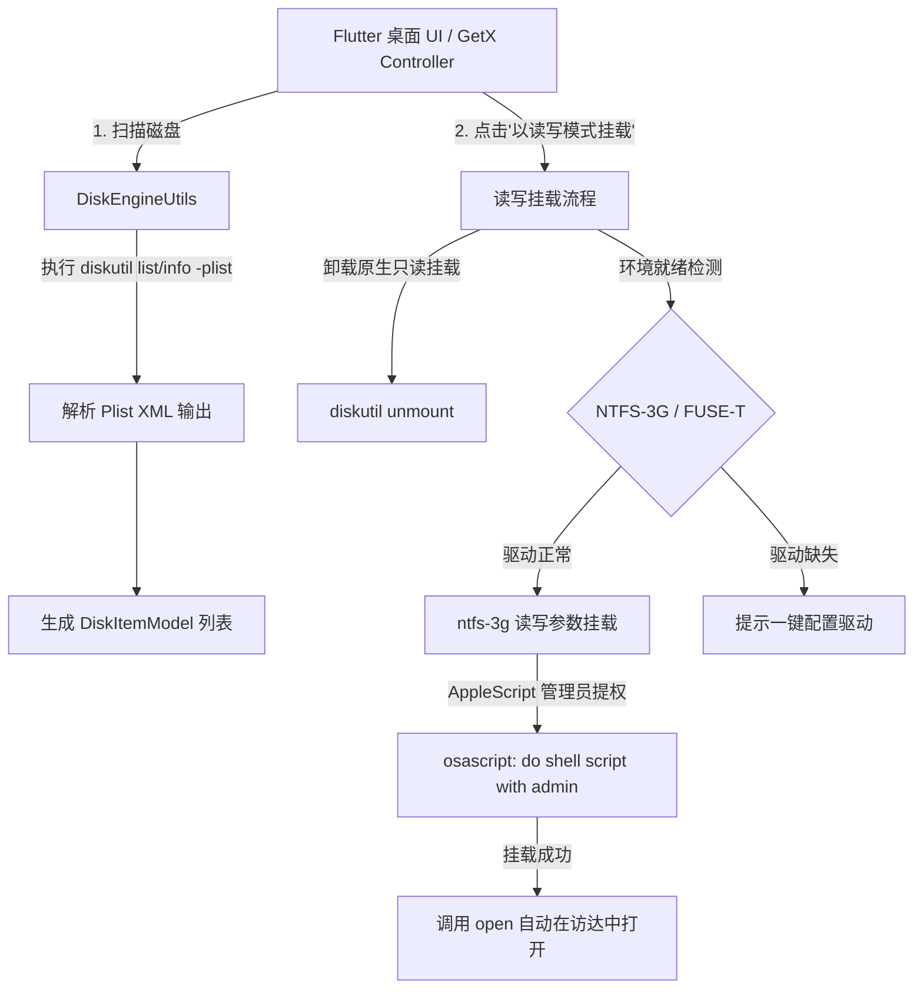

# MacNTFS Pro 工程原理与架构设计文档

## 一、项目概述

**MacNTFS Pro** 是一个专为 macOS 平台打造的高性能、轻量级 **NTFS 磁盘读写管理工具**。由于 macOS 原生出于兼容性与版权策略默认仅支持 NTFS 分区的只读挂载（Read-Only），本项目通过集成 macOS 原生底层磁盘命令行工具链（`diskutil`、`mount`、`osascript`）与现代开源用户态文件系统驱动（**`FUSE-T + NTFS-3G`**），实现了对 NTFS 外置磁盘/U 盘的一键读写挂载、状态监控、安全弹出与环境一键配置管理。

- **应用平台**：macOS Desktop (Intel x86_64 & Apple Silicon arm64)
- **技术栈**：Flutter (macOS) + GetX + ScreenUtil + EventBus + Xml
- **作者**：郭翰林
- **当前版本**：v1.0.0

---

## 二、核心工作原理



### 1. 磁盘与分区扫描机制
- **拓扑探测**：调用系统底层命令 `diskutil list -plist` 获取 macOS 系统的完整物理磁盘与分区拓扑。
- **Plist XML 解析**：使用 Dart `xml` 库解析输出的 XML Plist 结构，提取物理磁盘（`Partitions`）与 APFS 容器卷（`APFSVolumes`）。
- **分区详情提取**：对每个设备标识符（如 `disk2s1`），通过 `diskutil info -plist /dev/disk2s1` 查询具体属性：
  - **文件系统识别**：根据 `FilesystemType`、`FilesystemName`、`FilesystemUserVisibleName` 及 `Content` 判断是否为 NTFS（如 `Microsoft Basic Data`）。
  - **挂载状态与可写性**：解析 `MountPoint`、`Writable`、`WritableVolume` 判断当前是否可写。
  - **容量统计**：计算总容量、已用空间与可用剩余容量。
  - **系统卷过滤**：自动过滤系统内部无用卷（如 `Preboot`、`Recovery`、`VM`、`Update`、`xart` 等）。

### 2. NTFS 读写挂载突破原理（FUSE-T + NTFS-3G）
1. **解除原生占用**：若磁盘已被系统自动以只读方式挂载，先调用 `diskutil unmount /dev/diskXsY` 卸载。
2. **纯粹用户态 FUSE-T + NTFS-3G 挂载**：
   - 使用 `ntfs-3g` 将分区挂载到 `/Volumes/<卷名>`；
   - 注入优化参数：`-o local -o allow_other -o auto_xattr -o volname="<卷名>"`；
   - **免关 SIP，免降级安全策略**：FUSE-T 基于 macOS 本地 NFS 协议栈桥接，无需像旧版 macFUSE 那样进恢复模式降低系统安全级别。
3. **macOS 管理员提权（Privileged Script Execution）**：
   挂载 NTFS 到系统 `/Volumes` 目录需要 root 权限。工程通过 AppleScript 的 `do shell script "..." with administrator privileges`（经由 `osascript`）调起 macOS 原生授权弹窗，实现安全提权。
4. **自动化联动**：挂载成功后，通过 `open /Volumes/<卷名>` 自动在访达（Finder）中打开挂载好的磁盘目录。

### 3. 磁盘全生命周期管理
- **卸载（Unmount）**：优先使用 `diskutil unmount`，失败时自动尝试提权执行 `umount` 或 `diskutil unmount force`。
- **物理推出（Eject）**：通过 `diskutil eject` 安全断开并弹出外置存储设备。
- **周期轮询与即插即用**：`HomeController` 启动 6 秒周期的轻量轮询，实时感知 U 盘/移动硬盘的插拔及挂载状态变化。

### 4. 驱动环境离线内嵌与全自动就绪机制
- **Universal 离线驱动内置**：工程内嵌了支持 `arm64`（Apple Silicon）与 `x86_64`（Intel）的双架构通用版 **`FUSE-T.pkg`** 与 **`ntfs-3g`** 及其动态库（`libntfs-3g.dylib`、`libintl.8.dylib`）。
- **标准 PKG 安装器一键部署**：使用 macOS 原生 `pkgbuild` 与 `productbuild` 构建安装包。在安装 `MacNTFS Pro.app` 到 `/Applications` 时，触发 `postinstall` 自动以 root 权限静默安装 `FUSE-T` 并部署 `ntfs-3g`，**用户安装完 App 即驱动全部就绪，无需联网、无需任何配置**。
- **App 内部离线安装兜底**：即使极少数用户直接解压 `.app` 运行，App 也会自动定位内置的驱动资源包，点击“一键配置驱动”直接从本地离线安装，1秒完成。

### 5. 实时日志与控制台系统
- 全局日志（`loggerInfo`、`loggerWarn`、`loggerError`）通过 `EventBus` 实时推送到前端。
- 开发者与用户可点击顶部终端图标随时展开查看底层 Shell 命令执行细节与错误诊断信息。

---

## 三、工程目录结构与模块说明

```text
mac_ntfs_pro/
├── pubspec.yaml                     # 项目依赖配置文件
├── README.md                        # 项目说明文档
├── GEMINI.md                        # 工程原理与架构设计文档
├── assets/
│   └── driver/                      # 【离线驱动资源包】Universal 双架构驱动
│       ├── fuse-t.pkg               # FUSE-T 离线安装包 (23MB)
│       ├── bin/ntfs-3g              # Universal 二进制 (arm64 + x86_64)
│       └── lib/                     # Universal 动态链接库 (libntfs-3g, libintl)
├── scripts/
│   └── create_pkg.sh                # 【核心】macOS 标准 PKG 安装包打包脚本 (含 postinstall)
├── macos/                           # macOS 原生工程目录
│   └── Runner/                      # macOS App 启动入口与权限配置 (Entitlements)
└── lib/
    ├── main.dart                    # App 启动入口 (GetMaterialApp + ScreenUtil 初始化)
    │
    ├── defines/                     # 全局常量、样式与主题规范
    │   ├── ly_colors.dart           # 全局色彩 (浅色/深色主题、主色、状态色)
    │   ├── ly_constants.dart        # 常用路径与元信息常量 (ntfs-3g 路径)
    │   └── ly_fonts.dart            # 字体与排版样式定义
    │
    ├── events/                      # 全局 EventBus 跨组件事件
    │   └── disk_events.dart         # 磁盘刷新、挂载状态变更、环境诊断、日志消息事件
    │
    ├── utils/                       # 核心工具与底层命令引擎
    │   ├── disk_engine_utils.dart   # 【核心引擎】磁盘扫描(plist解析)、FUSE-T读写挂载、卸载、推出
    │   ├── env_engine_utils.dart    # 【环境检测】内置离线驱动定位、FUSE-T/NTFS-3G 自检与离线静默安装
    │   ├── ly_utils.dart            # 通用工具 (Toast提示、字节格式化、提权脚本执行、访达联动)
    │   ├── logger_utils.dart        # 日志格式化与 EventBus 消息广播
    │   └── event_bus_utils.dart     # EventBus 实例单例
    │
    ├── widgets/                     # 自定义通用基础 UI 组件库
    │   ├── ly_badge.dart            # 状态徽标 (只读/读写/未挂载标签)
    │   ├── ly_button.dart           # 自定义按钮 (支持 Loading、主/次级样式)
    │   ├── ly_card.dart             # 扁平卡片组件 (带悬停与边框样式)
    │   └── ly_input.dart            # 输入搜索框组件
    │
    └── pages/
        └── home/                    # 首页模块
            ├── home_page.dart       # 首页主视图 (顶部工具栏、状态条、磁盘列表、日志控制台)
            ├── controllers/
            │   └── home_controller.dart # 首页业务逻辑控制器 (状态管理、轮询定时器、操作调度)
            ├── models/
            │   ├── disk_item_model.dart  # 磁盘分区实体 (容量、文件系统、设备节点、挂载点等)
            │   └── env_status_model.dart # 驱动环境状态实体 (FUSE/NTFS-3G状态)
            └── views/
                ├── disk_item_card.dart   # 单个磁盘卡片 (容量进度条、读写挂载、卸载、推出按钮)
                ├── disk_detail_dialog.dart # 磁盘详细参数对话框 (UUID、底层属性)
                ├── env_status_banner.dart # 驱动就绪状态提示横幅 (支持一键配置驱动)
                ├── empty_disk_view.dart  # 空磁盘状态占位视图
                └── log_console_view.dart # 底部可折叠的实时执行日志控制台
```

---

## 四、各层级职责划分

| 层次 | 目录/文件 | 核心职责 |
| :--- | :--- | :--- |
| **表现层 (UI/Views)** | `lib/pages/home/views/` + `lib/widgets/` | 提供符合 macOS 原生质感的浅色/深色自适应界面，展示磁盘容量、状态与操作按钮。 |
| **控制层 (Controllers)** | `lib/pages/home/controllers/` | 响应用户交互，管理磁盘列表、搜索过滤、轮询机制及日志流。 |
| **模型层 (Models)** | `lib/pages/home/models/` | 定义强类型实体数据模型（`DiskItemModel`、`EnvStatusModel`）。 |
| **引擎/基础设施层 (Utils)** | `lib/utils/disk_engine_utils.dart` 等 | 直接通过进程与 macOS 底层（`diskutil`、`mount`、`osascript`）交互，完成 Plist XML 解析与提权挂载。 |
| **安装包与驱动分发** | `scripts/create_pkg.sh` + `assets/driver/` | 自动化打包 Universal 离线驱动与 postinstall 钩子，生成免联网的一键安装器。 |

---

## 五、构建与分发流程

### 1. 运行与调试
```bash
# 获取 Flutter 依赖
flutter pub get

# 运行 macOS 桌面端
flutter run -d macos
```

### 2. 编译与打包一键安装包 (PKG)
```bash
# 1. 编译 macOS Release 版本
flutter build macos --release

# 2. 生成标准 PKG 安装包 (内置驱动 + postinstall 钩子)
chmod +x scripts/create_pkg.sh
./scripts/create_pkg.sh
```
执行完毕后，将在桌面输出：
- `~/Desktop/MacNTFS_Pro_Installer.pkg`（双击一步安装 App 与全部驱动，开箱即用）

### 3. 一键彻底卸载与清理
```bash
chmod +x scripts/uninstall.sh
sudo ./scripts/uninstall.sh
```
将一键彻底移除 App 本体、用户配置缓存、FUSE-T 驱动框架及 `/usr/local` 下的全部依赖库与软链接。

---

## 六、开发与维护规范

- **禁止自动打包**：每次执行完任务之后**不要进行打包操作**（除非用户显式要求打包）。
- **禁止自动 Commit**：修改后的代码或新生成的代码禁止进行 `git commit`。


