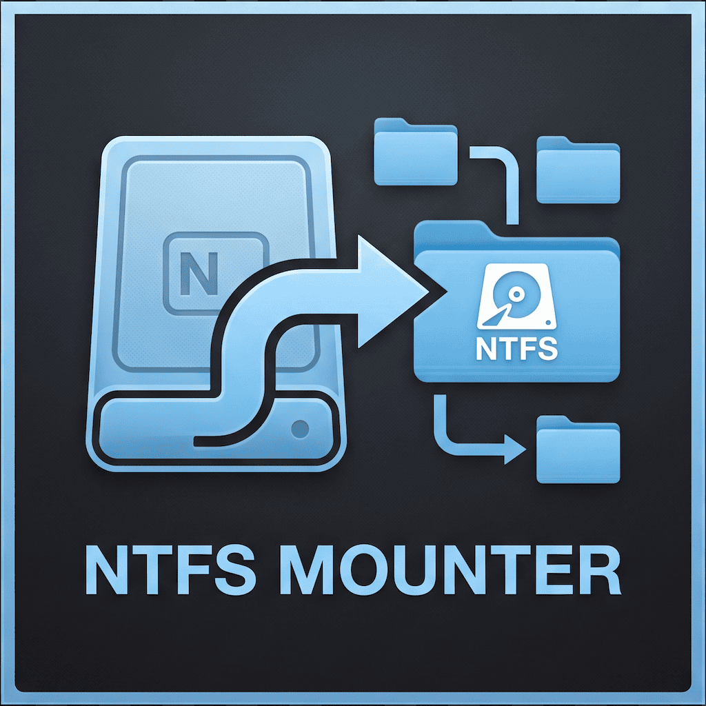

<div align="center">



# MacNFTSPro

### 专为 macOS 打造的高性能 · 轻量级 · 免降安全策略的 NTFS 磁盘读写管理专家

<p align="center">
  
  
  
  
  
  
</p>

<p align="center">
  <a href="#-为什么选择-macnftspro">为什么选择</a> •
  <a href="#-核心特性与亮点">核心特性</a> •
  <a href="#-安装指南">安装指南</a> •
  <a href="#-macos-安全拦截排查必读">安全拦截排查</a> •
  <a href="#-快速使用教程">使用教程</a> •
  <a href="#-技术架构与工作原理">技术架构</a> •
  <a href="#-常见问题-faq">常见问题</a> •
  <a href="#-一键彻底卸载">彻底卸载</a>
</p>

</div>

---

## 💡 为什么选择 MacNFTSPro？

macOS 原生出于版权与策略考量，对 NTFS 格式的外置磁盘/U 盘**默认仅开放只读权限（Read-Only）**，导致用户无法直接往移动硬盘中写入、修改或删除文件。

传统解决方案往往面临以下痛点：
- ❌ **商业软件价格高昂**：如 Paragon / Tuxera，单机授权昂贵且大版本升级常需重复付费；
- ❌ **安全风险与繁琐配置**：旧版 macFUSE 方案要求用户**重启进入 Recovery 恢复模式、降级内核安全级别、关闭 SIP（系统完整性保护）**，极易引入系统内核崩溃风险；
- ❌ **原生命令行繁琐易错**：每次插拔都需要手动输入复杂的终端挂载指令，容易出现占用无法卸载或损坏卷元数据；
- ❌ **卸载残留垃圾多**：很多工具卸载后在 `/Library` 与后台守护进程中残留大量后台驱动垃圾。

### 🌟 方案全方位对比

| 对比维度 | **MacNFTSPro (本项目)** | 商业 NTFS 软件 (如 Paragon) | 旧版 macFUSE 方案 | 原生终端手动挂载 |
| :--- | :--- | :--- | :--- | :--- |
| **SIP / 安全策略** | 🛡️ **免关 SIP，免降安全等级** | 需要安装系统扩展 (KEXT/SEXT) | ⚠️ 需关 SIP 并降级安全策略 | ⚠️ 极不稳定且新系统常失效 |
| **内核安全性** | 🟢 **纯用户态 (FUSE-T NFS 桥接)** | 需高权限内核扩展 | 依赖内核注入，易引发 Kernel Panic | 原生只读驱动强行挂载 |
| **费用与授权** | 🎁 **完全免费开箱即用** | 💵 昂贵的商业买断/订阅制 | 免费但配置极其繁琐 | 免费 |
| **驱动安装门槛** | 📦 **PKG 安装包全自动静默部署** | 需引导用户前往系统设置繁琐授权 | 需手动敲指令配置动态库 | 每次需手动敲命令行 |
| **界面与即插即用** | ✨ **现代化 Flutter 原生质感 UI** | 商业界面 | 无图形界面 / 简陋托盘 | 无界面 |
| **卸载干净度** | 🧹 **一键彻底清除（0 残留保证）** | 残留难以排查干净 | 需手动查找删除系统文件 | 无需卸载 |

---

## 🌟 核心特性与亮点

- 🛡️ **免关 SIP，免降安全等级**：基于现代 **FUSE-T** 用户态文件系统框架，利用本地 NFS 协议栈桥接，**无需进恢复模式降低系统安全性**，对系统核心完全无入侵。
- ⚡ **原生级高速 NTFS 读写**：集成深度调优的 Universal `NTFS-3G` 驱动引擎，优化缓存与传输吞吐，大文件/海量小文件拷贝飞速稳定。
- 🔌 **硬件级即插即用自感知**：底层监听 `DiskArbitration` 硬件事件与 `NSWorkspace` 卷通知，设备插入、拔出、挂载状态变动秒级自动刷新。
- 📁 **自动访达（Finder）深度联动**：点击挂载成功后，自动在访达中唤起并打开目标磁盘卷根目录，无缝拖拽传输文件。
- 📦 **Universal 双架构离线驱动内置**：安装包内置 Universal 通用二进制驱动，完美原生适配 **Apple Silicon (M1/M2/M3/M4 系列)** 与 **Intel (x86_64)** Mac。
- 🖥️ **实时诊断控制台**：内置可折叠的底层执行日志终端，实时展示 `diskutil`、`mount` 与提权脚本执行细节，排查问题一目了然。
- 🧹 **一键彻底干净卸载（Zero-Footprint）**：内置一键卸载清理引擎，一键彻底移除 App 本体、用户缓存以及 `/usr/local` 下全部驱动与动态库，绝不留任何系统垃圾。

---

## 📥 安装指南

### 1. 获取安装包
下载最新的 **`MacNFTSPro_Installer.pkg`** 安装包。

### 2. 标准一键安装
双击运行 `MacNFTSPro_Installer.pkg`，根据安装器指引点击“继续”即可完成安装。安装程序会自动部署应用本体及底层驱动环境。

---

## ⚠️ macOS 安全拦截排查（必读）

> [!IMPORTANT]
> 由于本软件未向 Apple 购买每年 $99 的商业开发者签名公证证书，当您从网络（网盘、微信、QQ 或浏览器）下载安装包后，macOS 原生 **Gatekeeper 安全防护机制** 可能会弹出安全拦截提示。**这属于 macOS 的标准保护行为，软件本身 100% 安全开源无害。**

请根据您遇到的具体提示进行简单放行：

### 🛑 场景一：双击安装包提示“无法打开，因为来自未知开发者”或“Apple 无法检查其是否包含恶意软件”

```
┌────────────────────────────────────────────────────────┐
│ ⚠️ 无法打开“MacNFTSPro_Installer.pkg”，因为 Apple 无法  │
│    检查其是否包含恶意软件。                             │
│    macOS 无法验证此软件包是否来自已知开发者。            │
│                      [ 移到废纸篓 ]   [ 取消 ]           │
└────────────────────────────────────────────────────────┘
```

#### 解决方案（任选一种）：

- **方法 ①（推荐，仅需 2 秒）**：
  1. 在 `MacNFTSPro_Installer.pkg` 安装包图标上 **右键（或按住键盘 Control 键点按）**；
  2. 在弹出的右键菜单中点击 **【打开】**；
  3. 此时弹出的对话框会出现 **【打开】** 或 **【仍要打开】** 按钮，点击即可顺利开始安装。

- **方法 ②（通过系统设置放行）**：
  1. 打开 Mac **【系统设置】（System Settings）**；
  2. 进入 **【隐私与安全性】（Privacy & Security）**；
  3. 向下滚动至底部的“安全性”板块；
  4. 您会看到提示：*“已阻止使用 MacNFTSPro_Installer.pkg，因为来自身份不明的开发者”*；
  5. 点击其右侧的 **【仍要打开】** 按钮即可。

---

### 🛑 场景二：打开应用提示“已损坏，无法打开。你应该将它移到废纸篓”

```
┌────────────────────────────────────────────────────────┐
│ ❌ “MacNFTSPro”已损坏，无法打开。                      │
│    你应该将它移到废纸篓。                               │
│                      [ 移到废纸篓 ]   [ 取消 ]           │
└────────────────────────────────────────────────────────┘
```

#### 产生原因：
macOS 13 Ventura / 14 Sonoma / 15 Sequoia 对所有未经公证的网络下载文件强制附加了 `com.apple.quarantine`（隔离属性）。

#### 解决方案（终端一行命令彻底解决）：
1. 按键盘快捷键 `Command + 空格`，在 Spotlight 搜索框输入 **终端**（Terminal）并回车打开；
2. 复制并粘贴以下命令，按回车执行：
   ```bash
   sudo xattr -rd com.apple.quarantine /Applications/MacNFTSPro.app
   ```
3. 终端会提示输入当前 Mac 用户的开机锁屏密码（输入时密码不会显示，直接盲输完毕按回车）；
4. 执行完成后，返回“应用程序”再次双击 **MacNFTSPro** 即可秒速打开！

---

## 🚀 快速使用教程


### 步骤 1：连接设备
将 NTFS 格式的移动硬盘、U 盘连接至 Mac，启动 **MacNFTSPro**，主界面将自动扫描并展示所有分区信息（包括卷名、设备节点、文件系统与剩余空间）。

### 步骤 2：一键读写挂载
在目标 NTFS 分区卡片上，点击 **【以读写模式挂载】**：
- 系统将自动调起 macOS 原生提权授权弹窗；
- 输入 Mac 锁屏密码或通过 Touch ID 指纹确认；
- 软件将安全接管原生只读挂载，切换为全权限读写模式。

### 步骤 3：访达联动传输
挂载成功后，卡片状态将即时变为 **🟢 已挂载 (可读写)**，且软件会自动在**访达（Finder）**中打开该磁盘目录，您即可像使用本地硬盘一样自由拖拽复制、重命名、编辑与删除文件。

### 步骤 4：安全卸载与物理推出
- **卸载卷**：文件传输完毕后，点击卡片上的 **【卸载】** 按钮即可安全解除占用；
- **推出设备**：点击 **【推出设备】** 按钮，系统将安全断开整个外置硬件连接，确保写入缓存已完全刷入磁盘后再拔出设备。

---

## 🛠️ 技术架构与工作原理

MacNFTSPro 采用现代客户端与系统级驱动服务协同架构：

```text
┌─────────────────────────────────────────────────────────────────┐
│                     MacNFTSPro Desktop UI                       │
│             (Flutter 3 + GetX + ScreenUtil + EventBus)          │
└────────────────────────────────┬────────────────────────────────┘
                                 │
                   [ MethodChannel / Process API ]
                                 │
     ┌───────────────────────────┴───────────────────────────┐
     ▼                                                       ▼
┌───────────────────────────┐           ┌────────────────────────────────┐
│  磁盘拓扑扫描与状态监控   │           │    系统级提权挂载执行引擎      │
│  - diskutil list -plist   │           │    - AppleScript 提权授权      │
│  - diskutil info -plist   │           │    - 执行 unmount 释放只读占用 │
│  - DiskArbitration 监听   │           │    - 注入 ntfs-3g 读写挂载参数 │
└───────────────────────────┘           └──────────────┬─────────────────┘
                                                       │
                                                       ▼
                                        ┌────────────────────────────────┐
                                        │  FUSE-T 本地 NFS 桥接服务层    │
                                        │  (无需关闭 SIP / 纯用户态挂载)  │
                                        └──────────────┬─────────────────┘
                                                       │
                                                       ▼
                                        ┌────────────────────────────────┐
                                        │    /Volumes/<卷名> 挂载就绪    │
                                        │    自动触发 open Finder 打开   │
                                        └────────────────────────────────┘
```

- **挂载参数调优**：内置参数注入了 `local`, `allow_other`, `auto_xattr`, `windows_names`, `hide_hid_files`, `hide_dot_files`, `recover`, `remove_hiberfile` 等优化项，保证对 macOS 扩展属性（xattr）及 Windows 隐藏文件的完美兼容。
- **免密挂载 Helper**：在安装过程中预置了受系统保护的提权规则配置，使得后续读写挂载流畅稳定。

---

## ❓ 常见问题 FAQ

<details>
<summary><b>Q1: 读写挂载会破坏磁盘里原本的数据吗？</b></summary>
<br>
<b>绝对不会。</b> 底层采用成熟稳定的开源 <code>NTFS-3G</code> 驱动套件，该引擎在 Linux/Unix 生态中已有十余年的广泛验证与工业级稳定性，所有写入操作均符合标准 NTFS 文件系统规范。
</details>

<details>
<summary><b>Q2: 为什么点击挂载时需要输入 Mac 开机密码？</b></summary>
<br>
因为将文件系统挂载到系统根目录 <code>/Volumes</code> 属于 macOS 系统的敏感管理操作，必须通过系统级管理员权限授权（通过 macOS 原生 AppleScript 安全提权）。
</details>

<details>
<summary><b>Q3: 如果 NTFS 硬盘在 Windows 上未正常弹出导致脏卷（Dirty Volume）怎么办？</b></summary>
<br>
MacNFTSPro 在底层挂载指令中默认注入了 <code>recover</code> 与 <code>remove_hiberfile</code> 修复参数，能够自动清理 Windows 快速休眠锁定的元数据并正常挂载。
</details>

<details>
<summary><b>Q4: 拔出移动硬盘前需要注意什么？</b></summary>
<br>
为防止缓存数据尚未写入完成导致文件损坏，请务必在软件中点击 <b>【卸载】</b> 或 <b>【推出设备】</b>，待状态显示“已卸载/已推出”后再拔出硬件。
</details>

---

## 🧹 一键彻底卸载（0 残留保证）

如果您不再需要本工具，我们提供了完备的清理机制，杜绝任何驱动与文件残留：

- **方式 1（推荐，界面一键卸载）**：
  在 MacNFTSPro 界面右上角点击 **【彻底卸载应用与驱动】** 图标，在弹出的对话框中确认，应用将自动清除自身、用户偏好配置、FUSE-T 驱动框架及 `/usr/local` 下的相关库文件并安全退出。
- **方式 2（命令行清理脚本）**：
  在终端中执行项目内置的卸载清理脚本：
  ```bash
  sudo ./scripts/uninstall.sh
  ```

---

## 💻 开发者指南（编译与打包）

如果您希望基于源码进行二次开发或自行构建安装包：

```bash
# 1. 克隆代码并安装依赖
git clone https://github.com/RmondJone/mac_ntfs_pro.git
cd mac_ntfs_pro
flutter pub get

# 2. 本地调试运行
flutter run -d macos

# 3. 构建 Release 产物与标准 PKG 安装包
flutter build macos --release
chmod +x scripts/create_pkg.sh
./scripts/create_pkg.sh
```
构建完成后将在桌面输出：`~/Desktop/MacNFTSPro_Installer.pkg`。

---

## 📄 开源许可与版权声明

- **应用作者**：[RmondJone](https://github.com/RmondJone)
- **版权所有**：Copyright © 2026 RmondJone. All rights reserved.
- **开源协议**：本项目基于 [MIT License](LICENSE) 授权。集成的底层组件遵循各自开源协议：
  - [FUSE-T](https://github.com/macos-fuse-t/fuse-t)
  - [NTFS-3G](https://github.com/tuxera/ntfs-3g)
